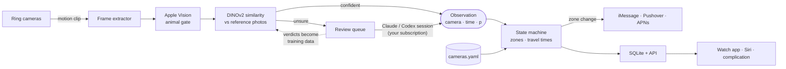
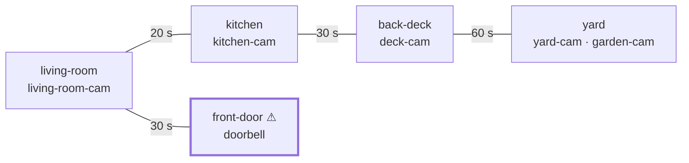

# Animal Tracker

**[Project website](https://johnm555.github.io/AnimalTracker/)** · [Setup guide](docs/Setup_Guide.md) · [Open issues](https://github.com/johnm555/AnimalTracker/issues)

Where is your animal right now? Animal Tracker answers that from your Ring
cameras, a Mac that stays on, and an Apple Watch — and it only ever reports what
a camera has actually seen.

Ring tells you "motion detected". Animal Tracker tells you "Max just went from
the back deck to the yard, 40 seconds ago, 92% sure". If no camera has seen
Max, it says so. It never guesses.

## How it works



Two ideas do all the work:

1. **Observations, not locations.** The vision layer is only ever asked one
   question: *is the animal in these frames the enrolled animal in the reference
   photos?* The answer is an `Observation` tied to a camera and a time. It is
   never asked where the animal is.
2. **A deterministic tracker turns observations into a location.** It knows your
   property's topology — which zones border which, and how long the walk takes.
   Once you've measured minimum walking times, a sighting that would need an
   impossibly fast trip is rejected as a different animal. Repeated
   sightings in one zone collapse into one stay; weak sightings need a second
   look before the location changes. Only confirmed zone changes notify.

**Example property** — the one in `backend/config/cameras.example.yaml`, which
`run.sh setup` replaces with yours. Edges are neighbors, labelled with a slow
walk in seconds; ⚠ marks the high-priority zone:



Kitchen → yard with no deck sighting in between is accepted with a small
confidence penalty: the deck camera probably just missed it. The template's
minimum walking times are 0, so nothing is rejected as too fast until you
measure them; once kitchen → back-deck is at least 8 s and back-deck → yard at
least 10 s, a yard sighting 5 s after a kitchen one is rejected as a different
animal, because the shortest path takes 18 s.

Most events are decided on the Mac in about 80 ms with no network call. The
rest wait for review by a Claude or Codex session on your existing
subscription — no API key, no per-token billing — and every verdict it records
becomes training data that lets the local models decide more on their own.

## Quick start

```bash
git clone https://github.com/johnm555/AnimalTracker.git
cd AnimalTracker
scripts/setup.sh                           # Python env, dependencies, tests
scripts/run.sh setup                       # Ring login, cameras → zones, notifications
# add 6+ photos of your animal to ~/Library/Application Support/AnimalTracker/reference_images/
scripts/run.sh doctor                      # checks everything, prints a fix for each problem
scripts/install-launchd.sh install         # run at login, restart on crash
scripts/install-launchd.sh review claude   # optional: an AI session reviews what the local models can't
```

Using Claude Code? Open the repo and say **"set up my property"**. The skills in
`.claude/skills/` cover setup, notifications, reviewing frames, training the
local models and troubleshooting; `AGENTS.md` points Codex and other agents at
the same playbooks.

**Guides:** [Setup](docs/Setup_Guide.md) · [Training the local models](docs/Training_Guide.md) ·
[Design decisions](docs/Design_Decisions.md)

## Requirements

- A Mac that stays on (a Mac mini is ideal), macOS 14+ — Apple Vision and Messages are part of the stack
- Python 3.11+
- Ring cameras with recordings enabled (Ring Protect)
- Optional: Claude or Codex for reviews; Xcode 16+ for the watch app; `ffmpeg` as a fallback frame extractor

## Your data stays out of the repo

Everything specific to your property lives in a data directory, never in this
repository (CI fails if it's ever committed):

```
~/Library/Application Support/AnimalTracker/      # or $ANIMAL_TRACKER_DATA
    config/settings.yaml    thresholds, Ring device ids, notification policy
    config/cameras.yaml     zones, cameras, travel windows
    reference_images/       photos of your animal
    tracker.db              observations, transitions, notifications (SQLite)
    .env                    API token, optional Pushover / APNs keys
    ring_token.cache        Ring refresh token
    staging/  ring_downloads/  evalset/  secrets/
```

## Commands

```bash
scripts/run.sh setup [--answers f.json]   # configure a property (validates the topology first)
scripts/run.sh doctor [--json]            # installation health check
scripts/run.sh api                        # the whole system: API on :8420 + Ring poller
scripts/run.sh ring-login                 # one-time Ring 2FA
scripts/run.sh detect list --sheets       # the review queue (sessions use this)
scripts/run.sh detect audit --sheets      # spot-check the local models' decisions
scripts/run.sh train status               # how the local models are doing, and what to do next
scripts/run.sh train export               # labelled frames for Create ML / fine-tuning
scripts/run.sh animals report             # other animals the cameras have seen
scripts/run.sh cleanup [--apply]          # disk retention
scripts/run.sh test                       # backend tests
scripts/run.sh watch-test                 # Swift AnimalTrackerCore tests
```

No cameras yet? Name clips `yard-cam__2026-09-20T14-03-11Z.mp4`, put them in a
folder, and replay them: `scripts/run.sh replay ./fixtures`.

## Notifications

- **iMessage** (macOS): moves are summarised once your animal settles; zones you
  mark high-priority (an exit door, the street side) alert immediately, even in
  quiet hours. Reply `status`, `mute`, `mute 30`, `unmute`, `off` or `on`.
- **Pushover**: cross-platform, one alert per move.
- **APNs**: native watch notifications and background complication refresh; needs
  a paid Apple Developer account.

## API

| Endpoint | Returns |
|---|---|
| `GET /tracker/location` | `state` (`seen` · `transitioning` · `last_seen` · `unknown`), zone, confidence, `last_seen_at`, `minutes_ago` |
| `GET /tracker/history?hours=24` | transitions in the last N hours |
| `GET /tracker/transitions?date=YYYY-MM-DD` | transitions on a local day |
| `GET /tracker/stats?hours=24` · `/tracker/trends?days=7` | time inside/outside, per-zone minutes, daily trends |
| `POST /tracker/observation` | ingest an observation → accepted?, transition, notification decision |
| `GET/POST /tracker/mute` | notification mute state |
| `POST /tracker/devices` | register a watch for APNs |
| `GET /animals` | sightings of other animals, by species |
| `GET /healthz` | poller, local models, storage and notification status — never a location |

When `ANIMAL_TRACKER_API_TOKEN` is set (the setup wizard generates one), writes require
`Authorization: Bearer <token>`; without it the API accepts writes from anyone on
your network, and `doctor` warns. Interactive docs for every endpoint are at
`http://<mac>:8420/docs`.

```json
GET /tracker/location
{"state": "seen", "zone": "yard", "confidence": 0.93,
 "last_seen_at": "2026-09-20T15:02:11+00:00", "minutes_ago": 0.7}
```

## Tuning

Thresholds live in the data-dir `settings.yaml`, not in code:

- `tracker.confidence_threshold` (0.70) — below this an observation is ignored.
- `tracker.strong_threshold` (0.90) — at or above, one sighting moves the location;
  in between, a second sighting must confirm.
- `notifications.cooldown_seconds`, `quiet_hours`, `high_priority_zones`.
- `detector.pipeline.*` — local-model bands; fit them with `scripts/run.sh train calibrate`.

Every rejected observation is logged with a reason (`implausible: kitchen -> yard
in 5s (minimum 18s)`), the fastest way to tune travel windows.

## Layout

```
backend/src/        Python: ring_client, frame_extractor, dog_detector (gate), local_detector (DINOv2),
                    local_pipeline, staging (review queue), state_machine, notification, db, api, pipeline
backend/tests/      hermetic pytest suite — no network, no credentials
backend/config/     settings.example.yaml, cameras.example.yaml
ios/AnimalTrackerWatch/   AnimalTrackerCore (SwiftPM) + watchOS app + WidgetKit complication
scripts/            run.sh entry point, setup wizard, doctor, train, review sessions, launchd installer
.claude/skills/     agent playbooks        docs/   guides and design notes
```

## Contributing

Run `scripts/run.sh test` and `scripts/run.sh watch-test` before a pull request.
Read [`CLAUDE.md`](CLAUDE.md) / [`AGENTS.md`](AGENTS.md) first — especially the one
rule: **never hallucinate a location.** Code, API responses and notification text
report only what cameras observed and the tracker derived.

## License

Animal Tracker is free software, licensed under the [GNU General Public License
v3.0](LICENSE). You may use, study, change and share it; if you distribute a
modified version, you must release its source under the same license.
Contributions are accepted under the same terms.

Copyright © 2026 John Marshall.

Animal Tracker is an independent project, not affiliated with or endorsed by
Ring, Amazon, Apple, Anthropic or OpenAI. It uses Ring through an unofficial
community API and reads local Messages and Find My data on your own Mac; you
are responsible for complying with those services' terms. It comes with no
warranty — don't rely on it as the only way to keep an animal safe.
